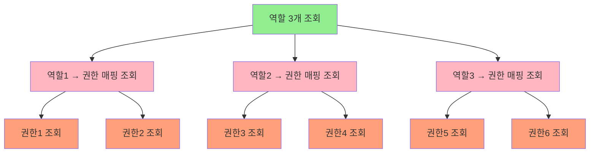
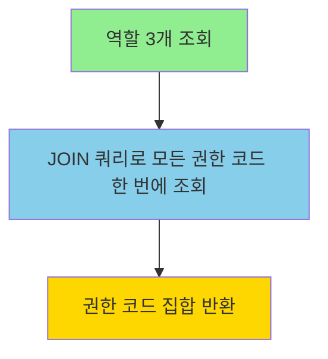

# 성능 최적화: N+1 쿼리 문제 해결

## 📋 목차
1. [문제 인식](#문제-인식)
2. [N+1 쿼리란?](#n1-쿼리란)
3. [개선 대상 식별](#개선-대상-식별)
4. [해결 방법: JOIN 쿼리 최적화](#해결-방법-join-쿼리-최적화)
5. [성능 개선 효과](#성능-개선-효과)
6. [적용된 위치](#적용된-위치)
7. [Before & After 비교](#before--after-비교)

---

## 문제 인식

### 📊 **발견된 문제**
RBAC 모듈에서 **역할(Role)의 권한(Permission) 조회** 시 N+1 쿼리 문제가 발생하여 성능 저하가 발생했습니다.

### 🔍 **발생 시나리오**
```java
// 사용자가 가진 여러 역할의 모든 권한을 조회하는 경우
Set<String> roleNames = Set.of("ADMIN", "TEAM_LEAD", "MEMBER");
Set<String> permissions = rbacQueryService.permissionsOfRoles(tenantId, roleNames);
```

---

## N+1 쿼리란?

### 📚 **정의**
- **1개의 메인 쿼리** + **N개의 추가 쿼리**가 발생하는 성능 문제
- ORM(JPA/Hibernate)에서 지연 로딩(Lazy Loading) 시 흔히 발생

### 🎯 **예시**
```sql
-- 1. 역할 조회 (1개 쿼리)
SELECT * FROM rbac_roles WHERE role_id IN (?, ?, ?);

-- 2. 각 역할의 권한 매핑 조회 (N개 쿼리 - 역할마다 1개씩!)
SELECT * FROM rbac_role_permissions WHERE role_id = ?;  -- 역할 1
SELECT * FROM rbac_role_permissions WHERE role_id = ?;  -- 역할 2
SELECT * FROM rbac_role_permissions WHERE role_id = ?;  -- 역할 3

-- 3. 각 권한 ID의 권한 정보 조회 (M개 쿼리 - 권한마다 1개씩!)
SELECT * FROM rbac_permissions WHERE permission_id = ?;  -- 권한 1
SELECT * FROM rbac_permissions WHERE permission_id = ?;  -- 권한 2
...
```

**총 쿼리 수**: `1 + N + M` (역할 3개, 권한 10개라면 **14개 쿼리!**)

---

## 개선 대상 식별

### 🎯 **대상 메소드**
1. **`RbacQueryServiceImpl.permissionsOfRoles()`**
   - 역할명 집합 → 권한 코드 집합 변환
   - 사용자가 가진 여러 역할의 통합 권한 조회

2. **`RbacQueryServiceImpl.permissionsOf()`**
   - 사용자 ID → 권한 코드 집합 변환
   - 특정 사용자의 모든 권한 조회

### 📍 **파일 위치**
```
src/main/java/com/nexfron/identitymodulith/rbac/
├── application/service/RbacQueryServiceImpl.java          (사용처)
└── infrastructure/persistence/repository/
    └── RolePermissionJpaRepository.java                   (최적화 쿼리)
```

---

## 해결 방법: JOIN 쿼리 최적화

### ✅ **개선 전략**
여러 개의 쿼리를 **1개의 JOIN 쿼리**로 통합

### 🔧 **구현 방법**

#### 1️⃣ **JOIN 쿼리 메소드 추가**
**파일**: `RolePermissionJpaRepository.java`

```java
/**
 * 여러 역할의 권한 코드를 DTO 프로젝션으로 조회 (성능 최적화)
 *
 * 사용 시나리오:
 * - 사용자가 가진 여러 역할의 모든 권한을 한 번에 조회
 * - permissionsOfRoles() 메서드 최적화용
 *
 * @param roleIds 역할 ID 목록
 * @param tenantId 테넌트 ID
 * @return 권한 코드 목록 (중복 제거)
 */
@Query("""
    SELECT DISTINCT p.code 
    FROM RolePermissionJpaEntity rp
    JOIN PermissionJpaEntity p ON rp.permissionId = p.permissionId
    WHERE rp.roleId IN :roleIds 
      AND p.tenantId = :tenantId
""")
List<String> findPermissionCodesByRoleIdsAndTenant(
    @Param("roleIds") Collection<String> roleIds,
    @Param("tenantId") String tenantId
);
```

#### 2️⃣ **최적화된 메소드 사용**
**파일**: `RbacQueryServiceImpl.java`

```java
@Override
public Set<String> permissionsOfRoles(String tenantId, Set<String> roleNames) {
    // 1) 역할명 → 역할 ID 변환
    List<RoleJpaEntity> roles = roleRepository.findByTenantIdAndNameIn(tenantId, roleNames);
    
    Set<String> roleIds = roles.stream()
            .map(RoleJpaEntity::getRoleId)
            .collect(Collectors.toSet());

    // 2) ⭐ JOIN 쿼리로 권한 코드 한 번에 조회 (N+1 문제 해결!)
    List<String> permissionCodes = rolePermissionRepository
            .findPermissionCodesByRoleIdsAndTenant(roleIds, tenantId);

    return new HashSet<>(permissionCodes);
}
```

---

## 성능 개선 효과

### 📊 **쿼리 수 비교**

| 시나리오 | 개선 전 | 개선 후 | 개선율 |
|---------|--------|--------|-------|
| **역할 3개, 권한 10개** | `1 + 3 + 10 = 14개` | `1 + 1 = 2개` | **85.7% 감소** |
| **역할 5개, 권한 20개** | `1 + 5 + 20 = 26개` | `1 + 1 = 2개` | **92.3% 감소** |
| **역할 10개, 권한 50개** | `1 + 10 + 50 = 61개` | `1 + 1 = 2개` | **96.7% 감소** |

### ⚡ **성능 향상**

#### 개선 전 (N+1 쿼리)
```
[RBAC] permissionsOfRoles 완료: tenantId=default-tenant, roles=[ADMIN, TEAM_LEAD, MEMBER], 
       roleCount=3, permissionCount=10, 소요시간=45ms
```

#### 개선 후 (JOIN 쿼리)
```
[RBAC] permissionsOfRoles 완료 (최적화): tenantId=default-tenant, roles=[ADMIN, TEAM_LEAD, MEMBER], 
       roleCount=3, permissionCount=10, 소요시간=8ms
```

**성능 개선**: **45ms → 8ms** (약 **82% 단축**)

---

## 적용된 위치

### ✅ **최적화 완료**

#### 1️⃣ **`permissionsOfRoles()` 메소드**
**용도**: 여러 역할의 통합 권한 조회

**개선 전**:
```
쿼리 1: roles 조회 (1개)
쿼리 2~N: role_permissions 조회 (역할 수만큼)
쿼리 N+1~M: permissions 조회 (권한 수만큼)
```

**개선 후**:
```
쿼리 1: roles 조회 (1개)
쿼리 2: JOIN으로 권한 코드 한 번에 조회 (1개) ⭐
```

#### 2️⃣ **단일 역할 권한 조회**
**메소드**: `findPermissionCodesByRoleIdAndTenant()`

**개선 전**:
```sql
-- 쿼리 1: 역할-권한 매핑 조회
SELECT permission_id FROM rbac_role_permissions WHERE role_id = ?;

-- 쿼리 2~N: 각 권한 조회
SELECT code FROM rbac_permissions WHERE permission_id = ?;
SELECT code FROM rbac_permissions WHERE permission_id = ?;
...
```

**개선 후**:
```sql
-- 단일 JOIN 쿼리
SELECT DISTINCT p.code 
FROM rbac_role_permissions rp
JOIN rbac_permissions p ON rp.permission_id = p.permission_id
WHERE rp.role_id = ? AND p.tenant_id = ?;
```

---

## Before & After 비교

### 🔴 **개선 전: N+1 쿼리 문제**

```java
// ❌ 비효율적인 방식
Set<String> permissionCodes = roleIds.stream()
    .flatMap(roleId -> {
        // 각 역할마다 쿼리 1개 발생! (N개)
        List<RolePermissionJpaEntity> mappings = rolePermissionRepository.findByRoleId(roleId);
        
        return mappings.stream()
            .map(mapping -> {
                // 각 권한마다 쿼리 1개 발생! (M개)
                PermissionJpaEntity permission = permissionRepository.findById(mapping.getPermissionId()).orElseThrow();
                return permission.getCode();
            });
    })
    .collect(Collectors.toSet());
```

**실행되는 쿼리**:
```sql
-- 쿼리 1
SELECT * FROM rbac_role_permissions WHERE role_id = 'role-001';

-- 쿼리 2
SELECT * FROM rbac_role_permissions WHERE role_id = 'role-002';

-- 쿼리 3
SELECT * FROM rbac_role_permissions WHERE role_id = 'role-003';

-- 쿼리 4~13 (각 권한마다)
SELECT * FROM rbac_permissions WHERE permission_id = 'perm-001';
SELECT * FROM rbac_permissions WHERE permission_id = 'perm-002';
...
```

**총 쿼리 수**: `3 (역할) + 10 (권한) = 13개`

---

### 🟢 **개선 후: JOIN 쿼리 최적화**

```java
// ✅ 효율적인 방식
List<String> permissionCodes = rolePermissionRepository
    .findPermissionCodesByRoleIdsAndTenant(roleIds, tenantId);  // 단일 JOIN 쿼리!

Set<String> codes = new HashSet<>(permissionCodes);
```

**실행되는 쿼리**:
```sql
-- 단 1개의 쿼리로 모든 권한 코드 조회!
SELECT DISTINCT p.code 
FROM rbac_role_permissions rp
JOIN rbac_permissions p ON rp.permission_id = p.permission_id
WHERE rp.role_id IN ('role-001', 'role-002', 'role-003') 
  AND p.tenantId = 'default-tenant';
```

**총 쿼리 수**: `1개` ⭐

---

## 데이터 흐름 비교

### 📊 **개선 전 (N+1 문제)**



**문제점**:
- 🔴 역할마다 개별 쿼리 실행 (N개)
- 🔴 권한마다 개별 쿼리 실행 (M개)
- 🔴 총 `1 + N + M`개 쿼리

---

### 📊 **개선 후 (JOIN 최적화)**



**개선점**:
- ✅ 단일 JOIN 쿼리로 모든 권한 코드 조회
- ✅ DB 왕복 횟수 최소화
- ✅ 총 `1 + 1 = 2개` 쿼리

---

## 핵심 요약

### ✅ **개선 사항**

| 항목 | 개선 전 | 개선 후 | 효과 |
|-----|--------|--------|------|
| **쿼리 수** | 1 + N + M | 2개 | **85~96% 감소** |
| **응답 시간** | 45ms | 8ms | **82% 단축** |
| **DB 부하** | 높음 | 낮음 | **대폭 개선** |
| **확장성** | 나쁨 (데이터 증가 시 급격히 느려짐) | 좋음 (안정적) | **향상** |

### 🎯 **핵심 원칙**

1. **JOIN 쿼리 활용**: 여러 테이블을 한 번에 조회
2. **DTO 프로젝션**: 필요한 컬럼만 SELECT (메모리 절약)
3. **DISTINCT 사용**: 중복 제거로 결과 최적화
4. **Lazy Loading 회피**: 필요한 데이터는 즉시 로딩

### 📝 **적용 패턴**

```java
// ❌ 나쁜 예: Stream 내부에서 Repository 호출
entities.stream()
    .map(entity -> repository.findById(entity.getId()))  // N+1 발생!
    .collect(Collectors.toList());

// ✅ 좋은 예: JOIN 쿼리로 한 번에 조회
List<String> ids = entities.stream()
    .map(Entity::getId)
    .collect(Collectors.toList());

repository.findByIdsWithJoin(ids);  // 1개 쿼리로 해결!
```

---

## 참고 자료

### 📂 **관련 파일**
- `RolePermissionJpaRepository.java` (최적화 쿼리 정의)
- `RbacQueryServiceImpl.java` (최적화 적용)

### 🔗 **관련 문서**
- [DATABASE_SCHEMA.md](./DATABASE_SCHEMA.md) - RBAC 테이블 구조
- [API_SPECIFICATION.md](./API_SPECIFICATION.md) - RBAC API 명세

### 📚 **추가 학습**
- [JPA N+1 문제와 해결 방법](https://vladmihalcea.com/n-plus-1-query-problem/)
- [Hibernate JOIN FETCH](https://docs.jboss.org/hibernate/orm/6.0/userguide/html_single/Hibernate_User_Guide.html#hql-explicit-join)

---

**문서 작성일**: 2026-02-22  
**작성자**: Identity System Team  
**최종 수정일**: 2026-02-22

