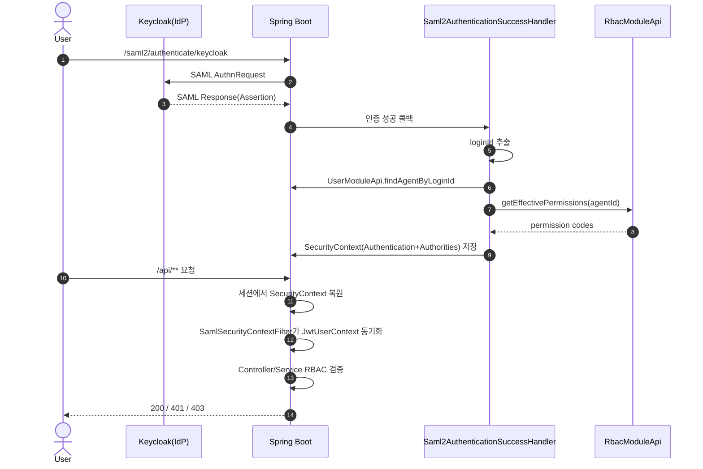

# Spring Security 인증/인가 흐름 분석 (현재 코드 기준)

> 목적: "토큰을 어떻게 검증하는지", "필터 체인이 어떻게 구성되는지", "인증 이후 인가가 어떻게 이어지는지"를 코드 기준으로 한 번에 파악
> 기준 시점: 현재 `main` 코드 (2026-04-17)

---

## 0) 한 줄 결론

- 이 프로젝트의 **실제 인증 흐름은 `SAML2 Login + 세션(SecurityContext)` 기반**입니다.
- `Spring Security Resource Server(jwt())` 또는 `JwtDecoder` 기반의 **인바운드 Bearer JWT 검증 체인은 현재 보이지 않습니다**.
- 인증 후 인가는 **로컬 RBAC(`RbacModuleApi`)** 로 수행되고, 요청 단위로 `JwtUserContext(ThreadLocal)`를 동기화해 사용합니다.

---

## 1) "토큰 검증"은 현재 어떻게 동작하나?

## 1-1. 정확히는 "JWT 검증"이 아니라 "SAML Assertion 검증"

인증 진입점은 `saml2Login()`이며, 핵심 설정은 `Saml2SecurityConfig.securityFilterChain()`에 있습니다.

- 참고 코드: `src/main/java/com/identitymodulith/common/security/Saml2SecurityConfig.java`
- 핵심: `http.saml2Login(...)`, `RelyingPartyRegistrations.fromMetadataLocation(...)`

즉, 브라우저가 Keycloak과 SAML Redirect/POST 플로우를 수행하면, Spring Security SAML2가 Assertion을 처리하고 인증 객체를 세션에 저장합니다.

## 1-2. JWT Resource Server 설정 부재

아래 항목이 코드/설정에서 확인되지 않습니다.

- `http.oauth2ResourceServer(oauth2 -> oauth2.jwt(...))`
- `JwtDecoder` 빈
- `spring.security.oauth2.resourceserver.jwt.issuer-uri` 또는 `jwk-set-uri`

참고 파일:
- `src/main/java/com/identitymodulith/common/security/Saml2SecurityConfig.java`
- `src/main/resources/application.yml`

## 1-3. 왜 "JWT"라는 용어가 보이나?

혼동 포인트가 3개 있습니다.

1. `JwtUserContext`라는 이름
   - 실제 역할은 "요청 스레드용 사용자 컨텍스트"(ThreadLocal)입니다.
   - 참고: `src/main/java/com/identitymodulith/common/security/context/JwtUserContext.java`
2. OpenAPI Bearer 스키마
   - Swagger 문서 스키마상 Bearer를 선언하고 있지만, 서버 인증 체인과 1:1로 보장되지는 않습니다.
   - 참고: `src/main/java/com/identitymodulith/common/config/OpenApiConfig.java`
3. Keycloak Admin API 호출 시 Bearer 사용
   - 이건 서버가 Keycloak API를 호출할 때의 아웃바운드 인증입니다.
   - 참고: `src/main/java/com/identitymodulith/user/infrastructure/keycloak/KeycloakAdminClient.java`

---

## 2) Spring Security 필터 체인 구성

기준 코드: `src/main/java/com/identitymodulith/common/security/Saml2SecurityConfig.java`

## 2-1. URL 인가 규칙

- `permitAll`
  - `/`, `/swagger-ui/**`, `/v3/api-docs/**`, `/actuator/**`, `/error`
  - `/saml2/**`, `/login/**`, `/logout/**`, `/.well-known/**`, `/favicon.ico`
  - `/api/me/status`
- `authenticated`
  - `/saml-info`
  - `/api/**`
- 나머지: `permitAll`

## 2-2. CSRF/CORS

- CSRF 예외: `/saml2/**`, `/login/saml2/**`, `/logout/saml2/**`
  - 브라우저 기반 SAML 리다이렉트/POST 플로우 특성 반영
- CORS 허용 origin
  - `app.frontend.url`, localhost, AWS Connect 도메인

## 2-3. 인증/로그아웃 핸들러

- `saml2Login.successHandler(...)`
  - `Saml2AuthenticationSuccessHandler`
- `saml2Login.failureHandler(...)`
  - `Saml2AuthenticationFailureHandler`
- `logout()` + `saml2Logout()` 모두 설정

## 2-4. 커스텀 필터 삽입 위치

```java
.addFilterAfter(samlSecurityContextFilter, SecurityContextHolderAwareRequestFilter.class)
```

- 필터: `SamlSecurityContextFilter`
- 역할: SecurityContext의 principal 정보를 `JwtUserContext`로 매 요청 동기화
- 요청 종료 시 `JwtUserContext.clear()`로 정리
- 참고: `src/main/java/com/identitymodulith/common/security/filter/SamlSecurityContextFilter.java`

---

## 3) 인증 성공 후 인가까지의 실제 흐름

기준 코드:
- 인증 성공 핸들러: `src/main/java/com/identitymodulith/common/security/handler/Saml2AuthenticationSuccessHandler.java`
- 권한 평가기: `src/main/java/com/identitymodulith/common/security/CustomPermissionEvaluator.java`
- RBAC 서비스: `src/main/java/com/identitymodulith/rbac/application/service/RbacManagementServiceImpl.java`
- API 진입 예시: `src/main/java/com/identitymodulith/rbac/presentation/RbacController.java`

## 3-1. 로그인 성공 시 1회 처리

`onAuthenticationSuccess()`에서 수행:

1. `Saml2AuthenticatedPrincipal`에서 username 추출
2. `userModuleApi.findAgentByLoginId(username)`로 로컬 Agent 매핑
3. Agent 미존재/비활성 시 로그인 실패 리다이렉트
4. `SimpleAuthPrincipal(tenantId, agentId)` 생성
5. `rbacModuleApi.getEffectivePermissions(agentId)`로 권한 코드 로드
6. `ROLE_AGENT + permission code`를 `GrantedAuthority`로 구성
7. `SecurityContextHolder`에 최종 Authentication 저장
8. `JwtUserContext`(tenant/user/username) 초기 세팅

핵심은 **인증은 SAML, 권한 데이터는 로컬 RBAC**라는 점입니다.

## 3-2. 이후 모든 요청에서 반복 처리

`SamlSecurityContextFilter`가 요청마다 다음을 수행:

1. 세션에서 복원된 `SecurityContext` 확인
2. principal이 `SimpleAuthPrincipal`이면 `JwtUserContext` 동기화
3. 컨트롤러/서비스 로직 실행
4. `finally`에서 `JwtUserContext.clear()`

이 구조로 ThreadLocal 오염(요청 간 데이터 누수)을 방지합니다.

## 3-3. 인가(Authorization) 판단 레이어

인가는 크게 2경로로 보입니다.

1. URL 레벨
   - `/api/**`는 인증 사용자만 접근
2. 비즈니스 레벨(RBAC)
   - `RbacController`는 `currentUserId()`로 사용자 식별 후 서비스 호출
   - `RbacManagementServiceImpl.checkAdminPermission()`에서 ADMIN 권한 검증

추가로 `CustomPermissionEvaluator`가 `MethodSecurityExpressionHandler`에 등록되어 있어
`@PreAuthorize("hasPermission(...)")` 방식도 사용할 준비는 되어 있습니다.

- 등록 위치: `Saml2SecurityConfig.methodSecurityExpressionHandler(...)`
- 평가 로직: `CustomPermissionEvaluator`

단, 현재 코드에서는 `@PreAuthorize` 실제 사용 흔적은 확인되지 않아, 주 인가 경로는 컨트롤러/서비스 내부 검증으로 보입니다.

---

## 4) 요청 시퀀스 다이어그램



---

## 5) 예외/응답 관점에서의 인증·인가 실패

- 인증 정보 없음
  - `UnauthorizedException` -> `401`
  - 참고: `src/main/java/com/identitymodulith/common/exception/CommonExceptionHandler.java`
- RBAC 권한 부족
  - `RbacException(INSUFFICIENT_PERMISSION)` -> `403`
  - 참고: `src/main/java/com/identitymodulith/rbac/presentation/RbacExceptionHandler.java`

---

## 6) 현재 구조의 장단점 (운영/면접 설명용)

장점:
- SAML SSO(브라우저 로그인)와 로컬 RBAC(세밀 인가) 분리로 책임이 명확
- 로그인 성공 시 권한을 Authority로 적재해 API 처리 단순화
- `SamlSecurityContextFilter` + `finally clear()`로 ThreadLocal 누수 리스크를 명시적으로 제어

주의점/트레이드오프:
- 무상태 Bearer JWT API(리소스 서버) 관점에서는 현재 체인과 모델이 다름
- `JwtUserContext` 명칭이 실제 동작(세션 + ThreadLocal)과 달라 온보딩 시 혼란 가능
- `CustomPermissionEvaluator`는 준비되어 있으나 `@PreAuthorize` 활용이 적어 정책 중앙화 이점이 제한될 수 있음

---

## 7) 왜 이런 구조/코드를 선택했을까? (코드 근거 기반 추정)

> 아래 내용은 ADR(Architecture Decision Record) 문서가 아닌, **현재 코드에 드러난 흔적을 바탕으로 한 추정**입니다.
> 즉 "의사결정 배경의 가능성이 높은 시나리오"로 이해하면 됩니다.

## 7-1. 인증은 Keycloak에 위임, 인가는 서비스가 소유

- `saml2Login()` + Keycloak SAML 메타데이터 설정이 중심인 점을 보면, 인증(로그인 성공/실패)은 IdP에 맡기고 앱은 결과를 수용하는 전략입니다.
- 반면 권한은 `RbacModuleApi`와 로컬 DB 기반으로 계산하므로, "누가 로그인했는가"와 "무엇을 할 수 있는가"를 분리하려는 의도가 보입니다.
- 근거: `src/main/java/com/identitymodulith/common/security/Saml2SecurityConfig.java`, `src/main/java/com/identitymodulith/common/security/handler/Saml2AuthenticationSuccessHandler.java`

## 7-2. 브라우저 SSO 현실에 맞춰 세션 중심으로 단순화

- `/saml2/**`, `/login/saml2/**` 예외 처리, `saml2Logout()` 구성, 성공/실패 핸들러를 보면 브라우저 리다이렉트 플로우를 기준으로 맞춘 구조입니다.
- 그래서 API 전체를 무상태 JWT 리소스 서버로 일원화하기보다, 인증 결과를 세션 `SecurityContext`에 저장해 후속 요청을 처리하는 방식이 선택된 것으로 보입니다.
- 근거: `src/main/java/com/identitymodulith/common/security/Saml2SecurityConfig.java`

## 7-3. 기존 코드와의 접점을 위해 ThreadLocal 브리지 채택

- `JwtUserContext`를 직접 참조하는 코드가 이미 존재하므로, 세션 기반 `SecurityContext`와 기존 ThreadLocal 컨텍스트 사이를 `SamlSecurityContextFilter`로 연결한 형태입니다.
- 즉 "새 인증 체계(SAML)"를 도입하면서도 "기존 서비스 호출 계약(JwtUserContext 조회)"을 크게 바꾸지 않으려는 점진적 전환 흔적으로 해석됩니다.
- 근거: `src/main/java/com/identitymodulith/common/security/filter/SamlSecurityContextFilter.java`, `src/main/java/com/identitymodulith/common/security/context/JwtUserContext.java`

## 7-4. 정책 중앙화 준비는 해두고, 실행은 서비스 레벨 중심

- `CustomPermissionEvaluator`와 `MethodSecurityExpressionHandler` 등록으로 `@PreAuthorize("hasPermission(...)")` 확장 포인트는 열어둔 상태입니다.
- 다만 실제로는 `RbacController -> RbacManagementServiceImpl.checkAdminPermission()` 경로가 주로 보이므로, 현재는 명시적 서비스 레벨 검증을 우선한 운영 단계로 보입니다.
- 근거: `src/main/java/com/identitymodulith/common/security/CustomPermissionEvaluator.java`, `src/main/java/com/identitymodulith/rbac/application/service/RbacManagementServiceImpl.java`

## 7-5. 운영 안정성 우선 선택(부분 실패 허용)

- 로그인 성공 시 RBAC 권한 로드가 실패해도 `ROLE_AGENT`로 진행하도록 처리되어 있어, 외부/내부 권한 조회 장애 시 로그인 전체를 막지 않으려는 운영 우선 성향이 보입니다.
- 이는 가용성을 높이는 대신, 일부 API에서 권한 부족(403)이 늦게 드러날 수 있는 트레이드오프를 동반합니다.
- 근거: `src/main/java/com/identitymodulith/common/security/handler/Saml2AuthenticationSuccessHandler.java`

---

## 8) 빠른 체크리스트 (지금 구조 파악용)

- [ ] 인증 방식: `saml2Login()`인가?
- [ ] API 보호 범위: `/api/**`가 `authenticated()`인가?
- [ ] 로그인 성공 시 `SimpleAuthPrincipal`/권한 Authority 세팅되는가?
- [ ] 요청마다 `SamlSecurityContextFilter`가 `JwtUserContext` 동기화/clear 하는가?
- [ ] 인가 로직이 서비스(`checkAdminPermission`) 또는 `hasPermission`으로 일관되게 적용되는가?

이 5개가 모두 맞으면, 현재 인증/인가 흐름을 정확히 이해한 상태입니다.
